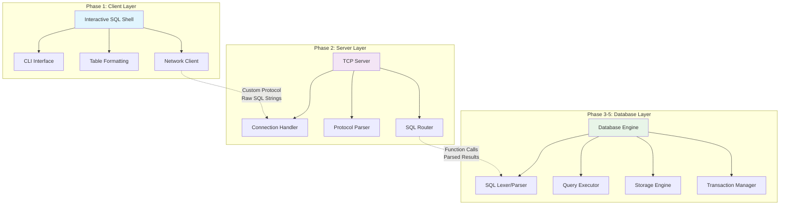

# Project Overview

## 🎯 What You'll Build

You'll create a complete **three-tier database system** from scratch: an interactive **client**, a networked **server**,
and a persistent **database engine**. This mirrors real-world software architecture and teaches systems programming
fundamentals.



### The Three Components

#### 1. **Client**: Interactive SQL Shell

- Command-line interface with readline support
- Network communication with the server

#### 2. **Server**: Multi-threaded TCP Server

- Customized protocol for client communication
- Concurrent client handling with 
- Structured logging and monitoring
- Configuration management and graceful shutdown

#### 3. **Database**: SQL Query Engine + Storage

- **SQL Processing**: Lexer, parser, and query execution
- **Type System**: INTEGER, VARCHAR, BOOLEAN, DECIMAL with NULL handling
- **Storage Engine**: B+ tree indexes and page-based file I/O
- **Transactions**: ACID properties with concurrency control

## 🏗️ Architecture Deep Dive

### Client-Server Communication

```
┌─────────────┐ Custom Protocol  ┌─────────────┐    Function    ┌─────────────┐
│   Client    │◄────────────────►│   Server    │     Calls      │  Database   │
│             │   Raw SQL        │             │    Raw SQL     │   Engine    │
│ - CLI       │                  │ - TCP       │                │ - Parser    │
│ - Formatter │                  │ - Protocol  │                │ - Executor  │
│ - Network   │                  │ - Routing   │                │ - Storage   │
└─────────────┘                  └─────────────┘                └─────────────┘
```

### Data Flow Example

1. **User Input**: `SELECT name, age FROM users WHERE age > 25;`
2. **Client**: Packages raw SQL in simple protocol message, sends to server  
3. **Server**: Receives protocol message, extracts SQL, forwards to database engine
4. **Database**: Lexes → Parses → Executes → Returns structured results
5. **Server**: Packages results in protocol response, sends to client
6. **Client**: Receives response, extracts data, displays formatted table to user

## 📚 Learning Progression

### Phase 1: Command-Line Client *(Weeks 1-2)*

**Goal**: Build a robust SQL shell with excellent user experience

**What You'll Learn**:

- CLI design and user interface principles
- Input validation and error handling
- Cross-platform development considerations
- Configuration management patterns

**Key Technologies**:

- Readline libraries for interactive input
- Argument parsing frameworks
- Table formatting and terminal output
- File I/O and configuration parsing

### Phase 2: Network Server *(Weeks 3-6)*

**Goal**: Create a production-ready TCP server

**What You'll Learn**:

- Network programming and TCP sockets
- Concurrent programming patterns
- Protocol design and message framing
- Structured logging and monitoring

**Key Technologies**:

- TCP socket programming
- Threading or async I/O
- JSON parsing and generation
- Logging frameworks

### Phase 3: SQL Processing *(Weeks 7-12)*

**Goal**: Build a complete SQL query engine

**What You'll Learn**:

- Formal language theory and parsing
- Compiler design principles
- Type systems and expression evaluation
- Query optimization fundamentals

**Key Technologies**:

- Lexical analysis and tokenization
- Recursive descent parsing
- Abstract syntax trees (ASTs)
- Hash maps and efficient data structures

### Phase 4: Persistent Storage *(Weeks 13-16)*

**Goal**: Implement disk-based storage with B+ trees

**What You'll Learn**:

- Operating system file I/O
- Tree algorithms and disk-based data structures
- Buffer management and caching
- Crash recovery and durability

**Key Technologies**:

- File system APIs
- B+ tree algorithms
- Memory management and caching
- Write-ahead logging

### Phase 5: Production Features *(Weeks 17-18)*

**Goal**: Add enterprise-grade features

**What You'll Learn**:

- Transaction processing theory
- Concurrency control mechanisms
- System administration and monitoring
- Performance optimization techniques

**Key Technologies**:

- Two-phase locking
- Deadlock detection
- Performance metrics collection
- Administrative tooling

## 🎯 Success Metrics

### Certification Levels

- **🥉 Bronze**: Client + Server (Phases 1-2)
- **🥈 Silver**: + SQL Processing (Phase 3)
- **🥇 Gold**: + Persistent Storage (Phase 4)
- **💎 Platinum**: + Production Features (Phase 5)

### Performance Targets

| Component | Metric | Target |
|-----------|---------|---------|
| Client | Startup time | < 500ms |
| Client | Command response | < 100ms |
| Server | Concurrent connections | 100+ |
| Server | Message latency | < 10ms |
| Database | Simple queries (1K records) | < 10ms |
| Database | Complex queries (10K records) | < 100ms |
| Storage | B+ tree operations | < 1ms |
| System | Transaction throughput | > 1000 TPS |

## 🧪 Testing Strategy

### Language-Agnostic Validation

All testing uses standardized interfaces that work regardless of your implementation language:

- **Client Testing**: Command-line interface validation
- **Server Testing**: JSON protocol compliance over TCP
- **Database Testing**: SQL query correctness and performance
- **Integration Testing**: End-to-end system validation

### Test Execution

```bash
# Test specific phase
./tools/test-runner/run_tests.sh --phase 1 --implementation student-submissions/my-implementation

# Test all completed phases
./tools/test-runner/run_tests.sh --all --implementation student-submissions/my-implementation

# Include performance benchmarks
./tools/test-runner/run_tests.sh --phase 3 --implementation student-submissions/my-implementation --benchmark
```

## 🚀 Getting Started

Ready to begin your journey? Here's your first steps:

1. **Choose Your Language**: Select a systems programming language you're comfortable with
2. **Set Up Environment**: Install required tools and dependencies
3. **Read Phase 1 Guide**: Understand the client requirements
4. **Start Building**: Begin with the basic CLI structure
5. **Test Early and Often**: Run tests to validate each step

The next chapter will guide you through the complete environment setup process.

**Let's build your database system!** 🔧